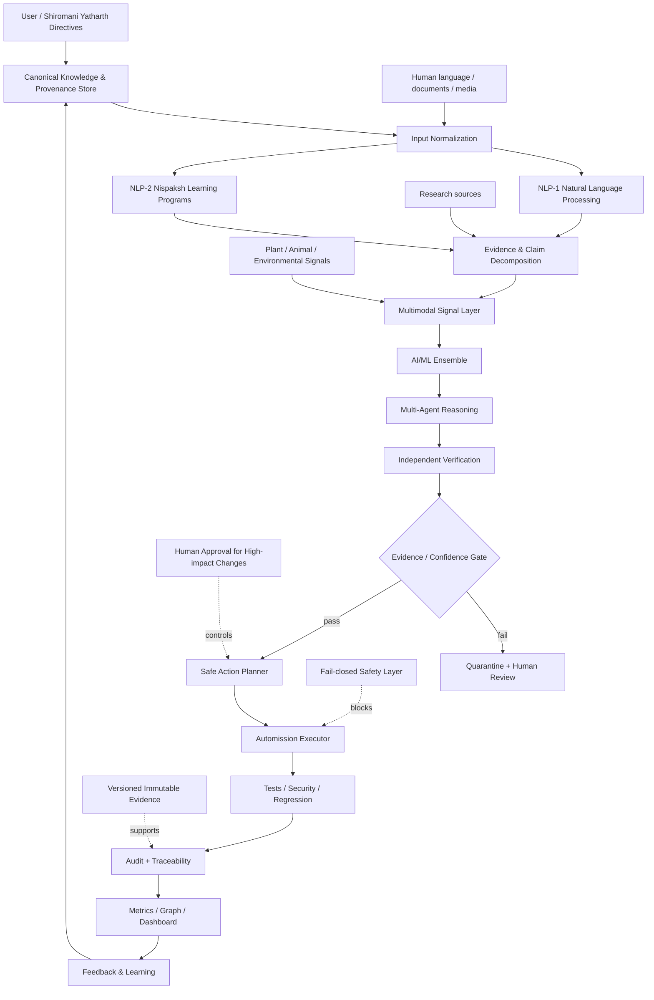

# TOTAL AUTOMISSION — Supreme AI/ML/NLP/Yatharth Architecture

## Core loop
**Observe → Collect → Normalize → Decompose → Research → Reason → Verify → Gate → Execute → Test → Audit → Learn → Improve → Repeat**

## Quality gates
Deterministic reproducibility · provenance · independent verification · confidence calibration · regression testing · fail-closed security · human approval for high-impact actions · audit trail · rollback · measurable latency/accuracy/error budgets

## Scientific boundary
“भाव/एहसास” को मनुष्य, पशु, वनस्पति या निर्जीव प्रणालियों में समझने का दावा empirical research के रूप में परीक्षण योग्य होना चाहिए। NLP validated signals को सरल भाषा में बदल सकता है, लेकिन subjective experience का प्रमाण बिना मापनीय evidence के घोषित नहीं करना चाहिए। “quantum” या “ultra mega infinity” दावों को भी reproducible, falsifiable hypotheses की तरह दर्ज किया जाना चाहिए।