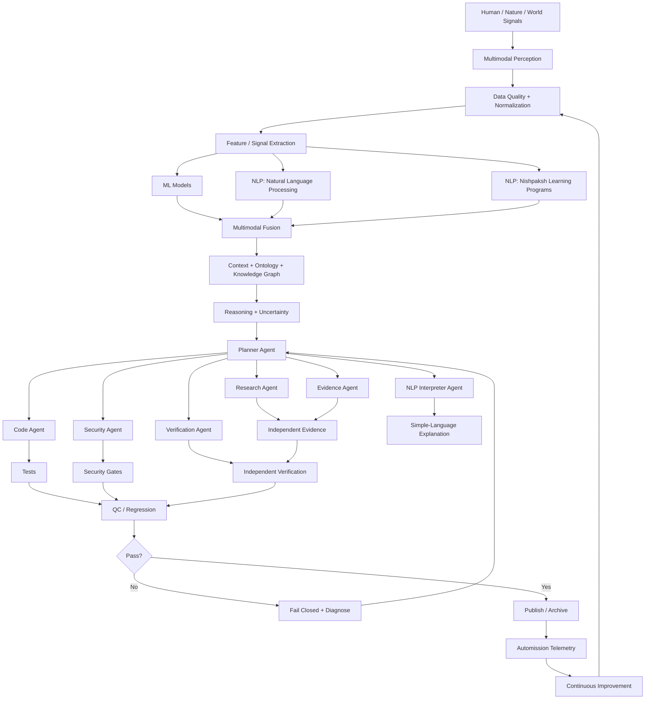

# Supreme AI–ML–NLP–Automission Total Graph

## उद्देश्य
AI Agent, ML, NLP और Automission को एक evidence-first, fail-closed, continuously audited research architecture में जोड़ना।

## Total flow

## Five-minute Automission quality loop

`Observe → Collect → Normalize → Analyze → Reason → Execute → Test → Verify → Audit → Learn → Improve`

## Accuracy contract

- Accuracy is measured, not declared.
- Every consequential output carries provenance and uncertainty.
- Independent verification is distinct from preparation/QC.
- Failed gates stop publication or production changes.
- AI agents remain bounded by explicit contracts.
- Human review remains required for high-impact actions.

## Biological / environmental signal interpretation

The system may ingest measurable signals from living organisms, plants, environments and non-living systems and translate detected patterns into plain language. It must distinguish:
1. measured signal,
2. model inference,
3. interpretation,
4. confidence,
5. unresolved uncertainty.

A model output is not automatically proof of subjective feeling or consciousness.

## Maturity ladder

Data → NLP → ML → Multimodal Intelligence → Agent Collaboration → Independent Verification → Continuous Audit → Automated Improvement → Human Approval

## Current repository baseline

The repository already contains a recent supreme AI-ML-NLP Automission quality-loop commit. This document extends that architecture into a single canonical graph and operating contract.
